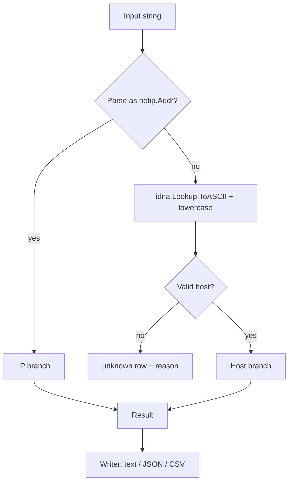
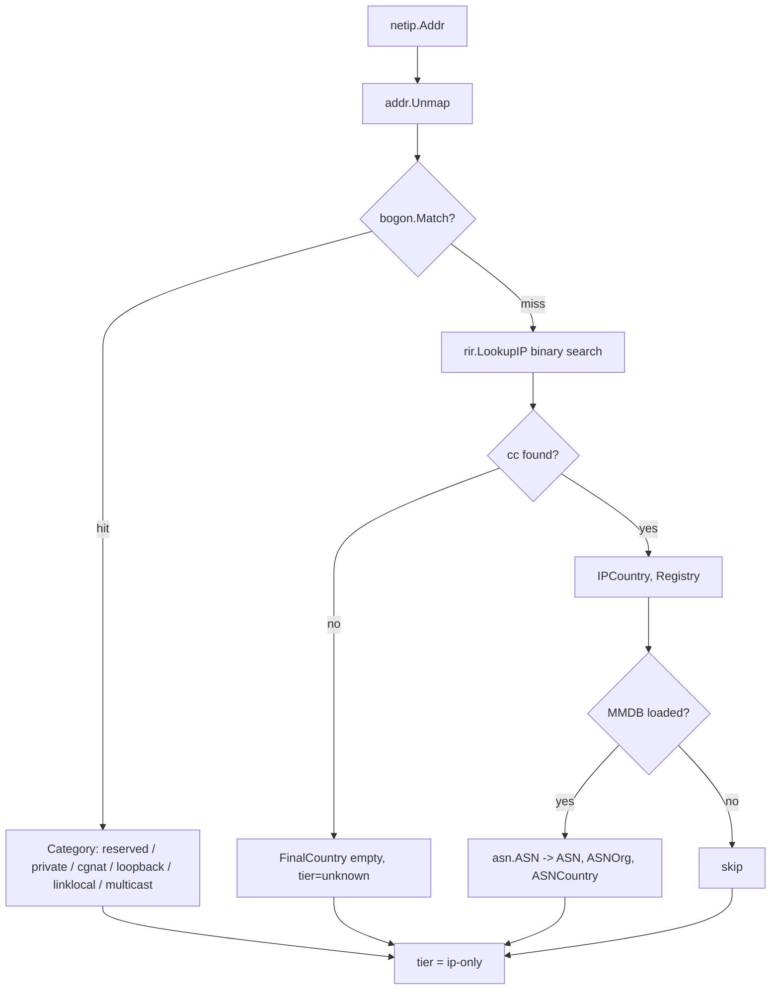
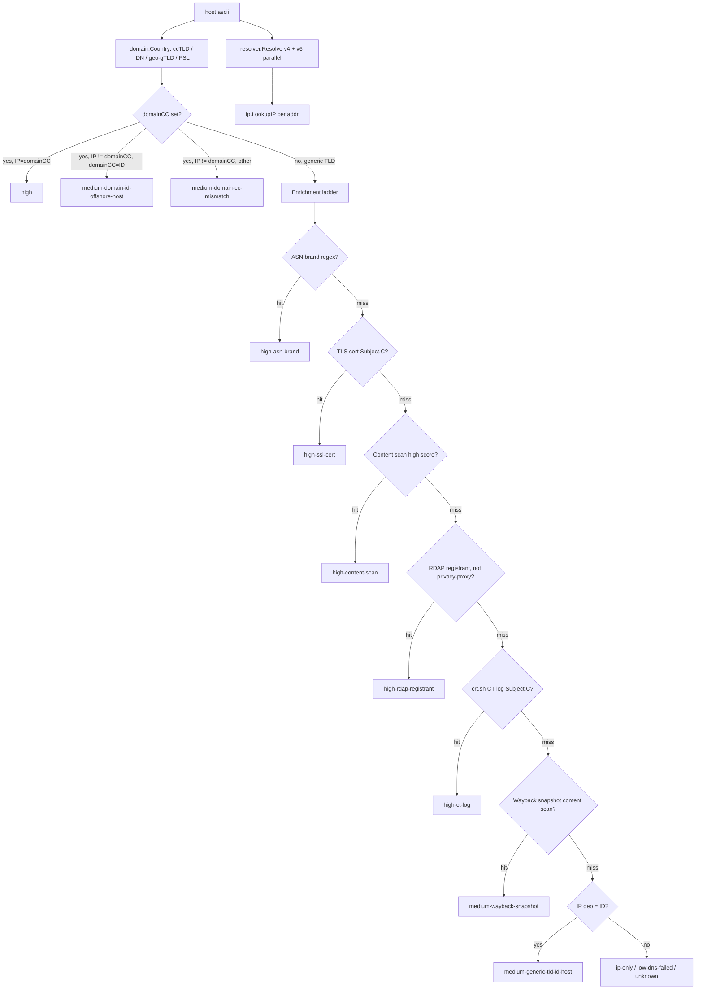
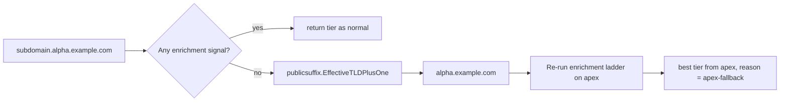
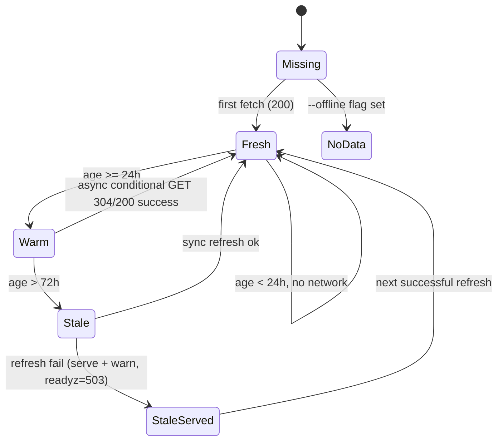
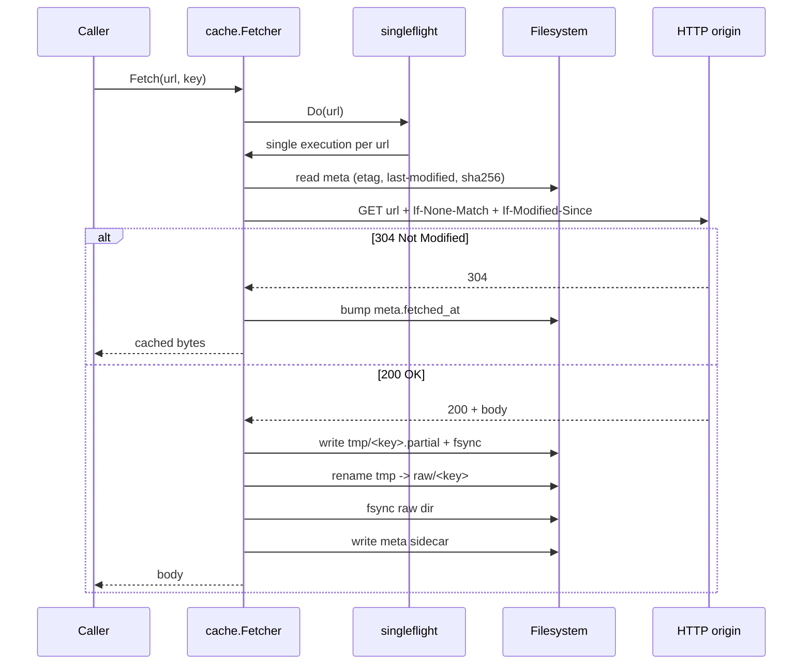
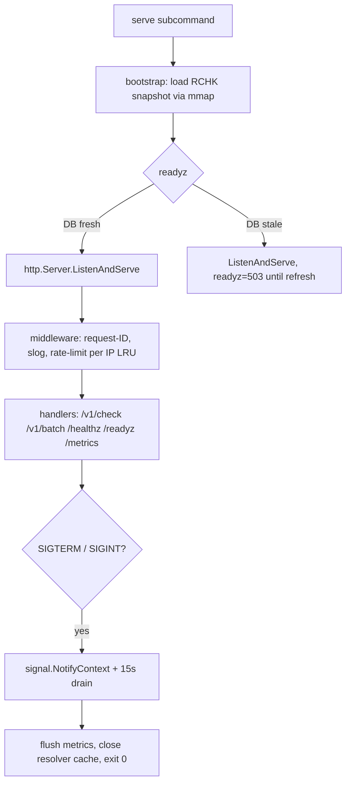

# Flowcharts

Mermaid diagrams for the runtime flow. Render in any GitHub/GitLab/Obsidian viewer.

## 1. Top-level dispatch

## 2. IP branch

## 3. Host branch — early-exit ladder

## 4. Apex fallback

## 5. Cache TTL state machine

## 6. Cache conditional GET + atomic write

## 7. HTTP server lifecycle

